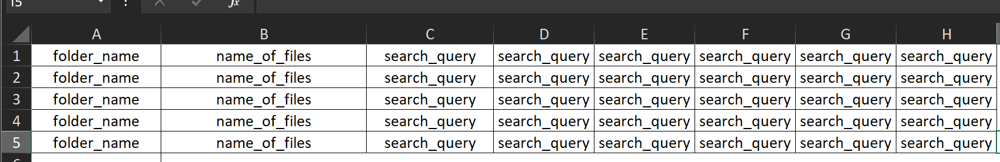
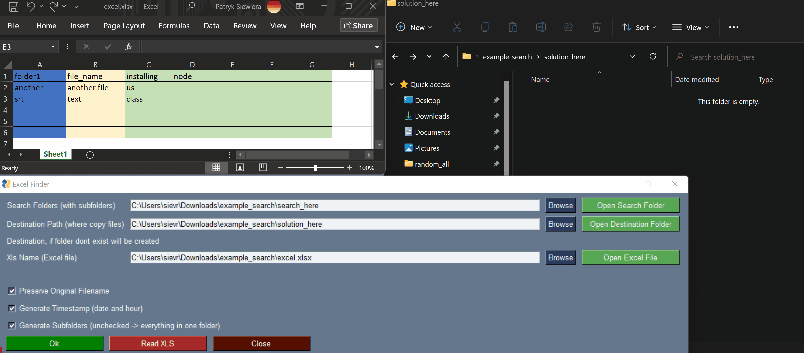
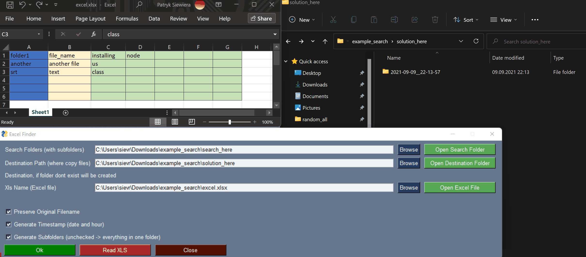
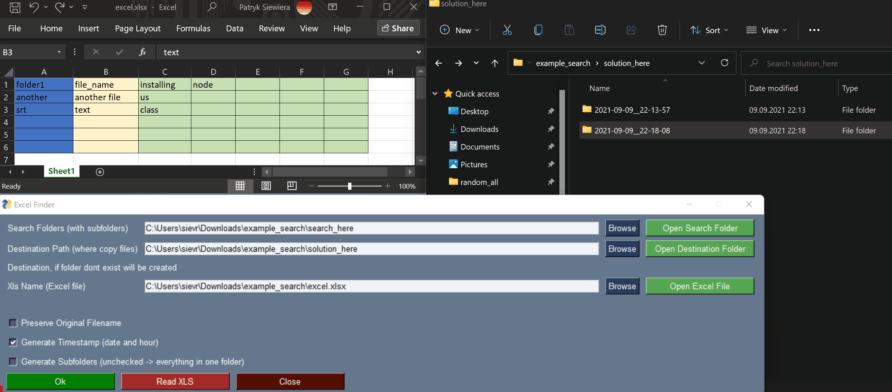

# How install the app

requirements:

`python 3.8 +`

use this command to install dependencies:

`python3 -m pip install -r requirements.txt`

open app:

`python3 app.py`

## Troubleshooting

be sure you are in the correct folder

# App description

App copy files searched by multiple queries (column C+); to the folders (column A) and name those files by filename (column B).

making subfolders, and naming files is optional

A column - folder name

B column - name that files

C+ column - find by that queries

#

## Excel schema

### Find and copy, **perserve name**, generate subfolder

### Find and copy, **change name to column B**, generate subfolder

### Find and copy, **don't create subfolders**

